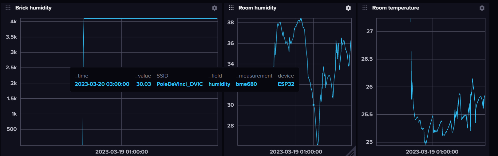

# Influxdb stack for esp32

in this repository you can find a docker-compose file to run an influxdb stack for esp32.

## Usage

to build the project use: 

    docker-compose build .

to run the project use:

    docker-compose up 

# BrickHumidity

BrickHumidity is a project to measure the humidity of a brick. The project is based on an esp32 and a BME680 sensor. The data is send to an influxdb database.

# Influx db's graphs

 
